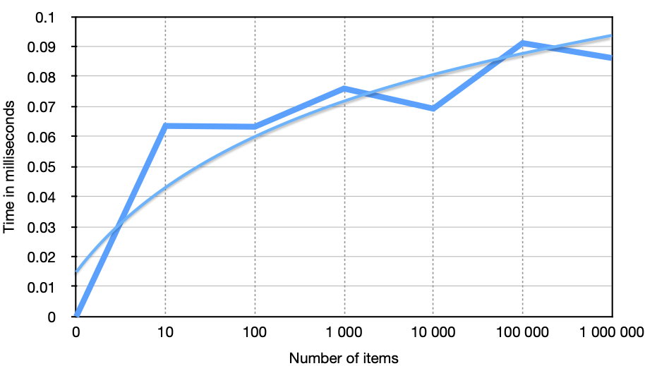

# Trie

A half done implementation of trie data structure as described in [Functional Swift by objc.io](https://www.objc.io/books/functional-swift/) book. 

## Performance

Performance was measured only for completions. Numbers in the grapg bellow are from running the measurement tests on a 15" MacBook Pro 2017 (3.1 GHz Quad-Core Intel Core i7).

